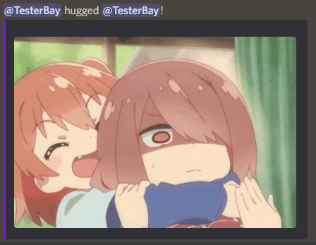

# <div align="center"> CuteGifs-PlugBot </div>
<div align="center">A plugin for discord PlugBot that allows the user to send Hug/Pat/Kiss gifs to other users. You can also customize the list of gifs.</div>

## Commands:

### ```/hug {user}```
- #### Send a hug to {user}


### ```/pat {user}```
- #### Send a pat to {user}


### ```/kiss {user}```
- #### Send a kiss to {user}


## Personalization

- #### You can add and modify the gifs that are used by the commands by modifying the respective txt file and adding urls of the gifs